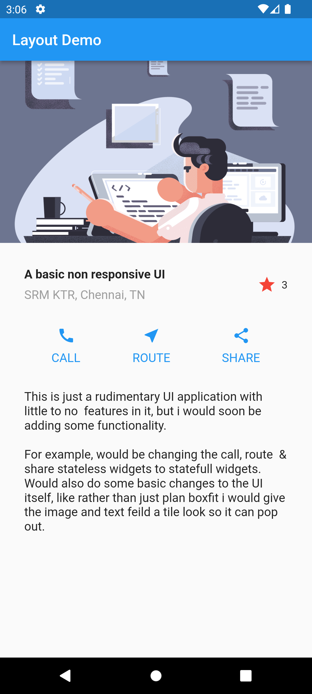

# UI Layout

This app showcases how to use Material UI components like Text, Icon, Image & ListView in a Stateless Widget.

## Table of Contents

- [Installation](#installation)
- [Screenshots](#screenshots)

## Installation

```bash
git clone https://AmanKRoy/UI_app.git
cd UI_app
flutter pub get
```

## Screenshots




## Credits

- [Flutter](https://flutter.dev/)
- [Dart](https://dart.dev/)
- [VS CODE](https://code.visualstudio.com/)


